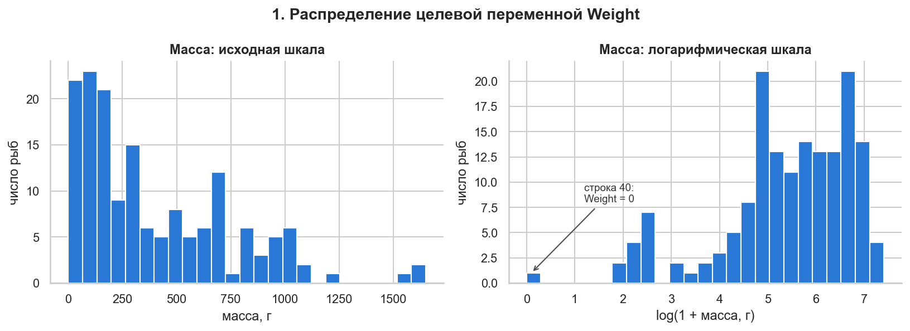
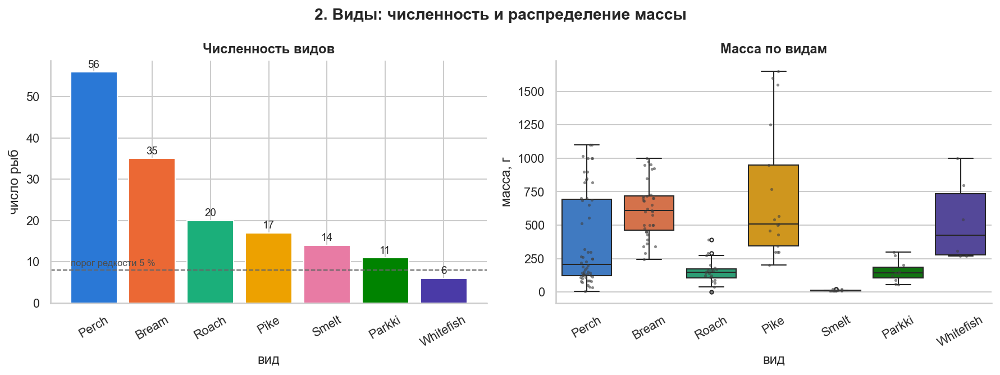
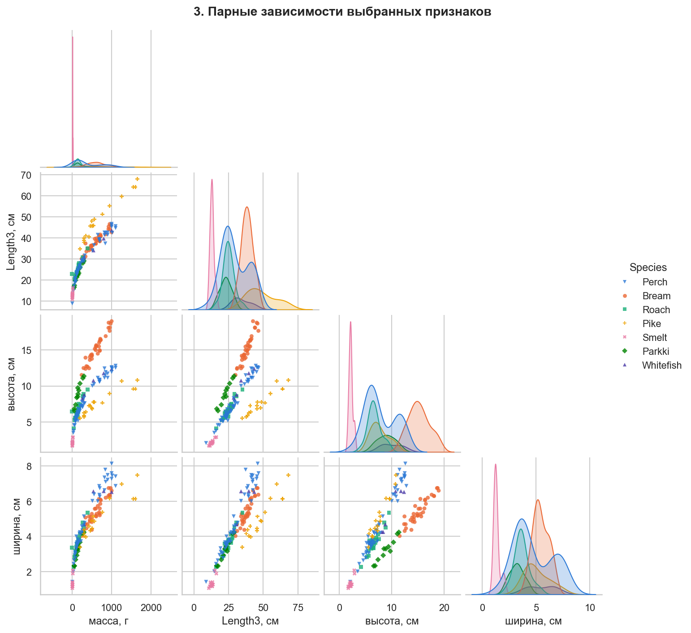
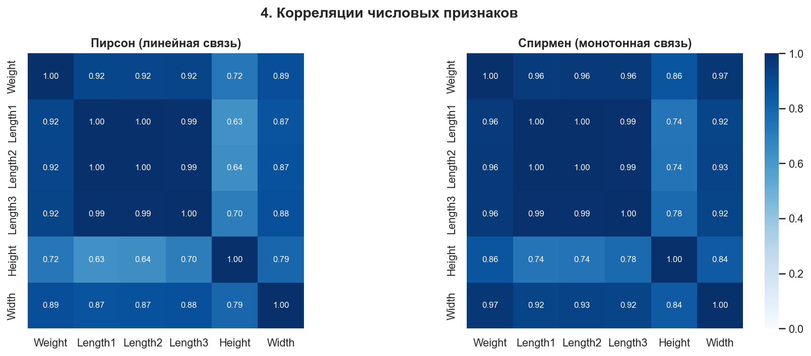
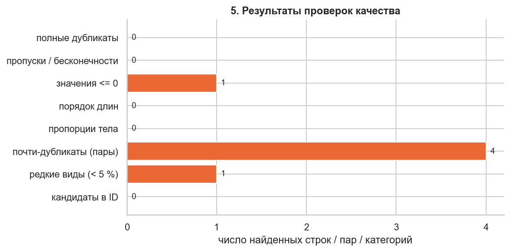
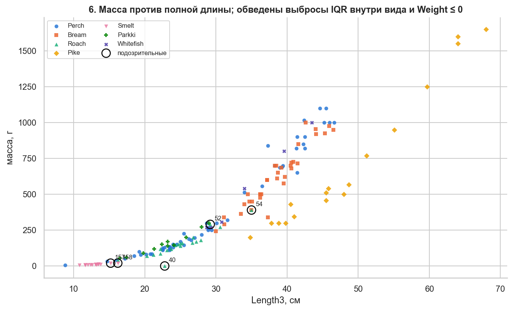
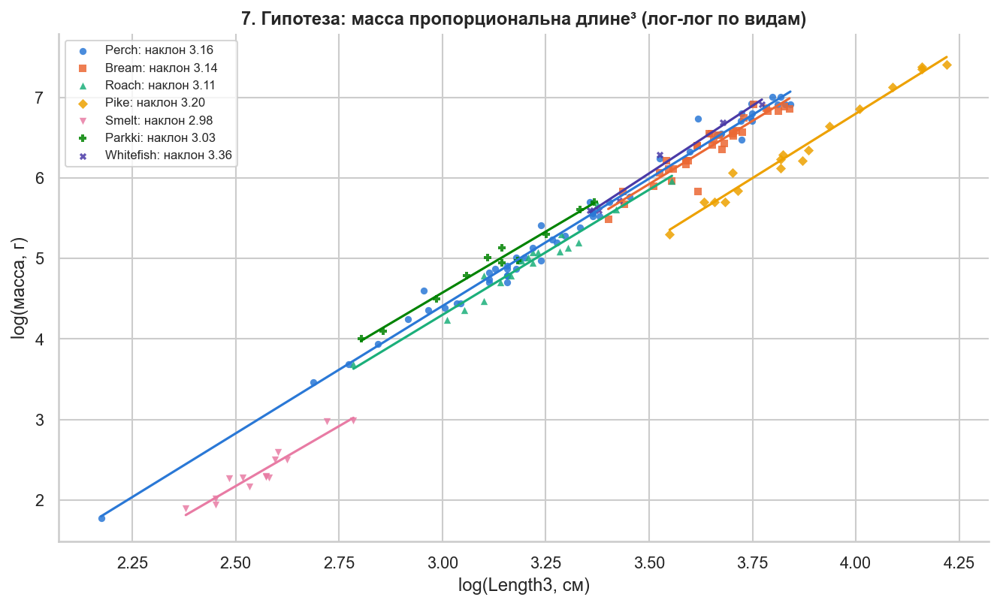

## 1. Исходное состояние и запуск

### Фактические сведения
- Репозиторий: https://github.com/tylerrussin/Fish-Dimensions-Regression-Analysis.git
- Исходный коммит: 1f65547b63c3043e2dcfff0c6435afa993331d4e (дата: 2022-02-25 06:43:52 -0800)
- Рабочая ветка: lab/01-eda
- Python версия: 3.9.13
- ОС: Windows 11 (сборка 26200; Python 3.9 сообщает как Windows-10-10.0.26200)

### Установка: журнал попыток

Pipfile требует `python_version = "3.7"`; зависимости зафиксированы в
Pipfile.lock. На машине установлен Python 3.12.0.

**Попытка 1. `pipenv install` (Python 3.12.0)**

    Warning: Python 3.7 was not found on your system...
    Python was not found on your system and none of 'pyenv', 'asdf', or
    'pymanager' could be found to install Python.

Причина: Python 3.7 не установлен (снят с поддержки в июне 2023 г.),
pipenv не может установить его сам.

**Попытка 2. `pipenv install --python 3.12`**

    Ignoring numpy: markers 'python_version < "3.10" ...' don't match your environment
    Ignoring scipy: markers 'python_version < "3.11" and python_version >= "3.7"' ...
    Collecting pandas==1.3.5
      Downloading pandas-1.3.5.tar.gz (4.7 MB)
      ...
      ModuleNotFoundError: No module named 'pkg_resources'
    ERROR: Failed to build 'pandas' when getting requirements to build wheel

Причина: для pandas 1.3.5 нет готовой сборки под Python 3.12, сборка из
исходников не проходит; numpy и scipy в Pipfile.lock ограничены маркерами
для Python < 3.10 / < 3.11. Вывод: Pipfile.lock на Python 3.12
неустанавливаем. Выбран Python 3.9.13 — минимальная доступная версия,
совместимая со всеми маркерами Pipfile.lock.

**Попытка 3. `pipenv install --python C:\Users\Max\AppData\Local\Programs\Python\Python39\python.exe`**

    Successfully created virtual environment!
    Warning: Your Pipfile requires "python_version" 3.7, but you are using 3.9.13
    ...
    This version of pip does not support python 3.9 (requires >=3.10).
    ERROR: Couldn't install package(s): ...

Причина: текущая версия pipenv (установлена в Python 3.12) использует
встроенный pip, не поддерживающий Python 3.9.

**Попытка 4 (успешная). venv + pip, Python 3.9.13**

- Окружение создано средствами PyCharm (venv, Python 3.9.13).
- Составлен `requirements.txt`: версии из Pipfile.lock (dash 2.1.0,
  pandas 1.3.5, flask 2.0.3 и др.); версии, не показанные в выводе
  установки, закреплены вручную на совместимых значениях начала 2022 г.:
  numpy 1.21.6, scipy 1.7.3, statsmodels 0.13.2, plotly 5.6.0, werkzeug 2.0.3.
- `pip install -r requirements.txt` — без ошибок.
- `python run.py` — приложение запущено, главная страница и страница
  Predictions работают.

**Дополнение: установка инструментов EDA**

При `pip install jupyter matplotlib seaborn pytest` pip обновил numpy до 2.0.2:

    ERROR: pip's dependency resolver does not currently take into account ...
    scipy 1.7.3 requires numpy<1.23.0,>=1.16.5, but you have numpy 2.0.2 which is incompatible.

Решение: `pip install "numpy==1.21.6" matplotlib seaborn` — pip подобрал
совместимые версии (matplotlib 3.8.4, seaborn 0.13.2). Проверено `pip check`.

### Итог изменений относительно исходного проекта
- Python 3.9.13 вместо 3.7;
- venv + pip вместо pipenv;
- `requirements.txt` вместо Pipfile.lock, 5 пакетов закреплены вручную;
- код приложения не изменялся.

### Требования проекта
- Менеджер зависимостей: pip
- Требуемая версия Python (pip): 3.9.13

### Воспроизводимость
- Начальное значение генератора: SEED = 42

### Установка зависимостей
- Подготовка: Сборка зависимостей проекта из pipfile.lock в requirements.txt. Инициализация виртуального окружения venv. 
- Команда: `pip install -r requirements.txt`
- Результат: успех
 
### Отчёт о запуске
- Команда: `python run.py`
- Результат: успех

- Команда: `python --version`
- Результат: Python 3.9.13

### Установка дополнительных библиотек
Установлены notebook, matplotlib, seaborn, pytest. Нужны для собственного EDA и тестов; в исходном проекте их нет

### Версии ключевых библиотек

Python 3.9.13, pip 23.2.1. Полный список — `pip list` / `requirements.txt`.

| Библиотека | Версия | Назначение | Источник версии |
|---|---|---|---|
| dash | 2.1.0 | веб-приложение | Pipfile.lock |
| dash-bootstrap-components | 1.0.3 | вёрстка приложения | Pipfile.lock |
| plotly | 5.6.0 | графики в приложении | закреплена вручную |
| flask | 2.0.3 | сервер Dash | Pipfile.lock |
| werkzeug | 2.0.3 | зависимость Flask | закреплена вручную |
| pandas | 1.3.5 | работа с таблицами | Pipfile.lock |
| numpy | 1.21.6 | вычисления | закреплена вручную |
| scipy | 1.7.3 | зависимость statsmodels | закреплена вручную |
| statsmodels | 0.13.2 | модель OLS | закреплена вручную |
| gunicorn | 20.1.0 | сервер для развёртывания | Pipfile.lock |
| notebook | 7.5.7 | блокнот Jupyter | добавлено для EDA |
| matplotlib | 3.8.4 | графики | добавлено для EDA |
| seaborn | 0.13.2 | статистические графики | добавлено для EDA |
| pytest | 8.4.2 | тесты | добавлено для EDA |

Прочие установленные пакеты

| Пакет | Версия |
|---|---|
| Brotli | 1.0.9 |
| click | 8.0.3 |
| colorama | 0.4.4 |
| dash-core-components | 2.0.0 |
| dash-html-components | 2.0.0 |
| dash-table | 5.0.0 |
| Flask-Compress | 1.10.1 |
| itsdangerous | 2.0.1 |
| Jinja2 | 3.0.3 |
| MarkupSafe | 2.0.1 |
| packaging | 21.3 |
| patsy | 0.5.2 |
| pyparsing | 3.3.3 |
| python-dateutil | 2.9.0.post0 |
| pytz | 2026.4 |
| six | 1.17.0 |
| tenacity | 9.1.2 |
| setuptools | 68.2.0 |
| wheel | 0.41.2 |

### Риски и допущения

| Утверждение                                                                                                     | Статус | Риск |
|-----------------------------------------------------------------------------------------------------------------|---|---|
| Height, Width вычислены из процентов от Length3                                                                 | подтверждено (159/159 строк) | признаки зависимы от Length3 по построению; точность ограничена округлением |
| Одна строка — одна независимая рыба                                                                             | предположение (нет ID, партии, даты) | если строки зависимы, разбиение без групп завысит качество модели |
| Типы полей в README (int) не совпадают с данными (float64)                                                      | подтверждено | документация неточна; доверять схеме только после проверки |
| Height и Width по README «в см», фактически вычислены из % от Length3                                           | подтверждено (159/159) | способ получения полей не документирован |
| Смысл Length1/2/3 («vertical / diagonal / cross length») неоднозначен и не совпадает с описанием первоисточника | неоднозначность | интерпретация длин не подтверждена; порядок L1 ≤ L2 ≤ L3 проверяется в разделе 2 |
| Первоисточник (kaggle.com/aungpyaeap/fish-market) недоступен: на странице автора датасета его нет               | подтверждено (проверено 01.10.2026) | лицензия и исходная версия данных не могут быть проверены; эталон — файл в репозитории, SHA256 зафиксирован |
| На Kaggle есть копии, созданные другими пользователями                                                          | факт | вторичные источники, соответствие исходнику не гарантировано |

### Паспорт данных

Единица наблюдения: одна рыба (предположение — идентификатора нет).
Размер: 159 строк × 7 столбцов. Пропусков нет.

| Поле | Смысл | Тип | Единицы | Роль | Пропуски | Диапазон / словарь | Источник | Что проверить |
|---|---|---|---|---|---|---|---|---|
| Species | вид рыбы | категориальный | словарь | признак; группа для стратификации | нет | 7 видов: Perch 56, Bream 35, Roach 20, Pike 17, Smelt 14, Parkki 11, Whitefish 6 | запись при улове | редкие виды, новые виды при эксплуатации |
| Weight | масса рыбы | числовой (float64; в README автора — int) | г (README автора; согласуется с диапазоном) | целевая | нет | 0–1650; > 0; 0 в строке 40 — аномалия | Kaggle Fish Market (Aung Pyae), по README автора | нули |
| Length1 | длина; в README — «Vertical length», трактовка неоднозначна | числовой (float64) | см (README) | признак | нет | 7,5–59,0 | README автора | L1 ≤ L2 |
| Length2 | длина; в README — «Diagonal length» | числовой | см (README) | признак | нет | 8,4–63,4 | README автора | L1 ≤ L2 ≤ L3 |
| Length3 | длина; в README — «Cross length» | числовой | см (README) | признак | нет | 8,8–68,0 | README автора | согласованность |
| Height | высота; в README — «Height» | числовой | см (README) | признак | нет | 1,73–18,96 | вычисление: % × Length3 / 100 (проверено; в README не указано) | зависимость от Length3 |
| Width | ширина; в README — «Diagonal width» | числовой | см (README) | признак | нет | 1,05–8,14 | вычисление: % × Length3 / 100 (проверено; в README не указано) | зависимость от Length3 |

## 2. Проверки качества
Проверки вынесены в модуль `src/data_checks.py`, чтобы их можно было
переиспользовать в следующих работах и тестах.

Почти-дубликаты 25/26, 103/104, 149/150, 152/153 оставлены
различаются масса и размеры — разные рыбы; пара 103/104 при разбиении помещается в одну часть как возможный повтор

## 3. Визуализация

Все графики построены в `notebooks/01-eda.ipynb` (раздел 3) и сохранены
в `reports/figures/`. Цвет вида дублируется формой маркера.

### 3.1. Распределение массы

В исходной шкале масса сильно скошена вправо: основная часть рыб легче
500 г (медиана 273 г, среднее 398 г), несколько крупных особей (до 1650 г)
образуют длинный правый хвост. После логарифмирования распределение
становится ближе к симметричному. Отдельно у нуля находится строка 40
(Weight = 0) — невозможное значение. Следствие: при моделировании
целесообразно предсказывать log(масса), тогда ошибки становятся
относительными и мелкие рыбы не теряются на фоне крупных.

### 3.2. Виды: численность и масса

Виды сильно несбалансированы: от 56 особей (Perch, 35 %) до 6 (Whitefish,
3,8 %); Whitefish — ниже порога редкости 5 %, при разбиении в тестовую
выборку попадёт 1 особь. Масса сильно зависит от вида: Smelt — до ~20 г,
Pike — до 1650 г; наибольший разброс массы у Pike и Perch, наименьший —
у Smelt и Parkki. Строка 40 видна как нижний выброс у Roach. Следствия:
вид — важный признак; выбросы нужно искать внутри вида; разбиение —
стратифицированное по виду.

### 3.3. Парные зависимости

Связь массы с длиной, высотой и шириной нелинейная (масса растёт быстрее
размеров) и различается по видам: при одинаковой длине Pike заметно легче
Bream и Perch. На графике «высота — длина» виды образуют отдельные лучи
с разным наклоном: пропорции тела видоспецифичны (Bream — высокий, Pike
и Smelt — вытянутые). Внутри вида размеры связаны почти линейно —
признак коллинеарности. Length1 и Length2 не показаны: они практически
дублируют Length3.

### 3.4. Корреляции

Все размеры сильно связаны с массой (Пирсон: Length3 — ≈ 0,92,
Width — ≈ 0,89, Height — ≈ 0,72). Коэффициенты Спирмена выше,
чем Пирсона: зависимость монотонная, но нелинейная, и Пирсон её
недооценивает. Length1, Length2 и Length3 коррелируют практически
полностью (≈ 0,99) — мультиколлинеарность. Height связана с остальными
признаками слабее, так как отражает форму тела, зависящую от вида.
Оговорка: корреляция по всей таблице смешивает виды и не доказывает
причинной связи.

### 3.5. Показатели качества данных

Данные в целом чистые: пропусков, бесконечностей, полных дубликатов,
нарушений порядка Length1 ≤ Length2 ≤ Length3 и невозможных пропорций
тела нет. Найдены: одно невозможное значение (строка 40, Weight = 0),
четыре пары почти одинаковых строк (разные рыбы; пара 103/104 держится
в одной части разбиения) и одна редкая категория (Whitefish).
Кандидатов в идентификаторы нет.

### 3.6. Выбросы

По правилу IQR внутри вида и условию Weight ≤ 0 помечены строки 40, 52,
54, 157, 158. Строки 52 и 54 (крупнейшая плотва), 157 и 158 (крупнейшая
корюшка) лежат на общей кривой масса–длина: это крупные особи
с нормальными пропорциями — выбросы по массе, но не ошибки. Строка 40
(длина 22,8 см, масса 0) выпадает из зависимости — ошибка ввода. Pike
образует отдельную ветвь ниже общего облака — особенность вида
(вытянутое тело), а не выброс. Одномерный IQR по массе не учитывает
размер рыбы, поэтому в разделе 4 дополнительно оценивается отклонение
массы от ожидаемой при данной длине.

### 3.7. Гипотеза «масса ~ длина³»

В лог-лог координатах зависимость массы от длины близка
к линейной для всех видов. Наклоны лежат в диапазоне 2.98-3.36, т. е.
близко к 3, что подтверждает гипотезу «масса пропорциональна длине³»
(при росте рыба в основном сохраняет форму). Прямые разных видов смещены
по вертикали: при равной длине виды различаются массой из-за формы тела.
Оценки для Whitefish (6 рыб) и Parkki (11) ненадёжны из-за малого числа
наблюдений. Строка 40 исключена (логарифм нуля не определён).
Следствие для модели: использовать log(масса), log(длины) и вид.

## Тесты
    python -m pytest tests/ -v

## Материалы
- Отчёт: `reports/lab01-report.md`
- Блокнот: `notebooks/01-eda.ipynb`
- Модули: `src/data_checks.py`, `src/splitting.py`
- Разбиение: `data/split_lab01.csv`